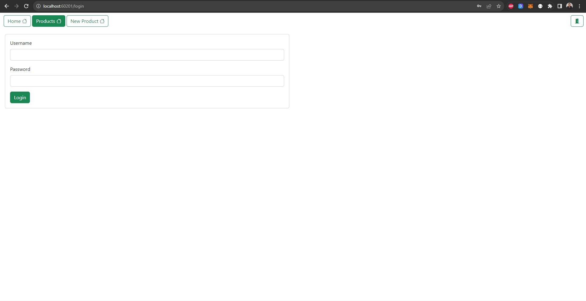
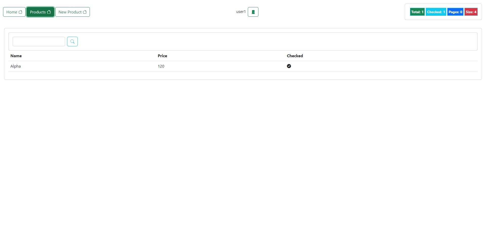
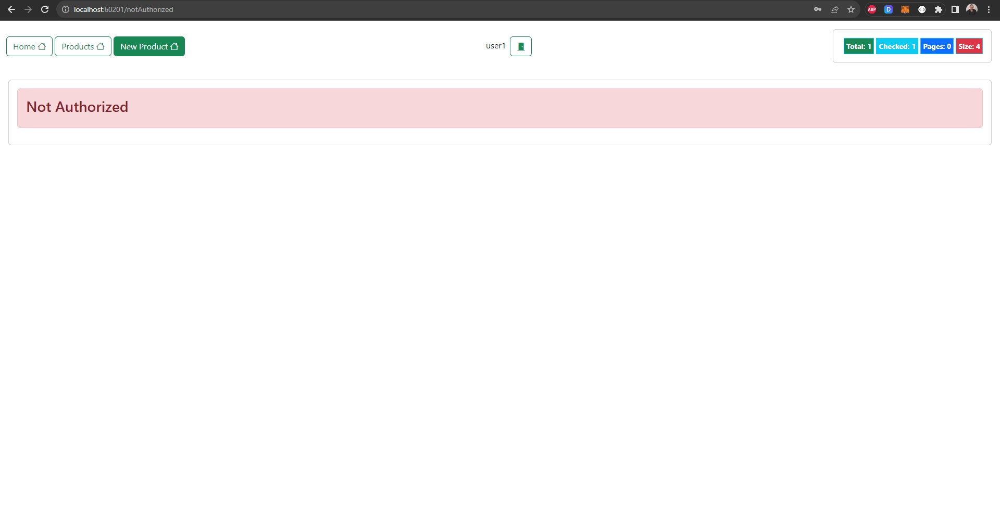

# Projet Angular avec JSON Server

Ce projet Angular constitue une application web complète intégrée de manière transparente avec un serveur JSON, offrant ainsi un backend robuste pour la gestion des données. Le projet exploite la puissance d'Angular, un framework front-end largement utilisé, pour créer une interface utilisateur dynamique et interactive.

## Technologies Utilisées

- **Angular :** Au cœur du développement front-end, Angular facilite la création d'une structure modulaire et évolutive pour l'application. Il permet l'intégration transparente de composants, de services, et la gestion de la navigation.

- **JSON Server :** Agissant en tant que backend, JSON Server est utilisé pour simuler une API RESTful et gérer les données via une base de données basée sur JSON. Cela simplifie le processus de développement en fournissant un serveur léger et facile à utiliser.

- **JSON Server Auth :** Une extension pour JSON Server qui ajoute des fonctionnalités d'authentification, assurant un accès sécurisé aux différentes parties de l'application.

 

The login page:

 

As an **'ADMIN'**, he can check all products, modify, and delete each of them:

 

To create a product, we get this message:

 

As a **'USER'**, he can only see the products:

 

Once the **'USER'** is trying to create a product, he gets this **"notAuthorized"** page:

